# Google Cloud Directory Sync with OpenLDAP


## Introduction
This is a tutorial on how to provision users and groups from a local LDAP server (OpenLDAP) into your G Suite domain.  Any users and groups present in your local LDAP server will get created in G Suite.  Once your users are present in your G Suite domain, you can authorize these users and groups access to Google Cloud Resources and other G Suite features.

This article is simply a tutorial on the simplified steps you would take for your on-prem directory server (ActiveDirectory, OpenLDAP).  The Directory Sync utility overwrites any existing G Suite users and groups in favor of your local LDAP.    As this is just a tutorial, only execute the 'dry-run' capabilities.  You will need Domain Admin user privileges to your G Suite domain.

This sample will only sync the basic Users and Groups objects from your LDAP to G Suite.

Some references on the Directory Sync tool:
* [https://support.google.com/a/answer/106368?hl=en](https://support.google.com/a/answer/106368?hl=en)
* [https://support.google.com/a/answer/6162412?hl=en](https://support.google.com/a/answer/6162412?hl=en)
* [https://support.google.com/a/topic/2679497](https://support.google.com/a/topic/2679497)
* [https://support.google.com/a/answer/6258071?hl=en](https://support.google.com/a/answer/6258071?hl=en)

If you are a Google Cloud Platform user, consider migrating your organization after you have setup Directory Sync
* [https://cloud.google.com/iam/docs/faq#how_do_i_use_google_groups_with_iam](https://cloud.google.com/iam/docs/faq#how_do_i_use_google_groups_with_iam)
* [https://cloud.google.com/resource-manager/docs/overview](https://cloud.google.com/resource-manager/docs/overview)


## OpenLDAP configuration
This tutorial runs a Docker container with a configurable OpenLDAP server that you can setup and load sample data reflecting your LDAP hierarchy.   The the sample LDIF file is very basic and enables the domain  `dc=example`, `dc=com` with users under `ou=users` and groups under `ou=groups`.

You can edit the `slapd.conf` file and `import.ldif` file to map to your users and directory structure.  You will need to initialize and load the LDIF files once the container starts up as shown below.

**NOTE:  I've made some specific modifications to the objectclass mappings for a users groups display name for simplicity.**


### Download the sample Dockerfile and LDAP configuration
* [`Dockerfile`](Dockerfile)
Initializes a plain OpenLDAP server on secure (ldaps://) and insecure (ldap://) ports.
* [`slapd.conf`](exportvolume/slapd.conf)
OpenLDAP configuration that defines the root password, baseDN and ACLs to apply
* [`import.ldif`](import.ldif)
Sample users and groups
* [`CA_crt.pem`](exportvolume/CA_crt.pem), [`ldap_crt.pem`](exportvolume/ldap_crt.pem), [`ldap_key.pem`](exportvolume/ldap_key.pem)
Self-signed certificate and chain for `ldaps://`

### Start the LDAP server
The first step is to setup the local LDAP server.  You will need to clone the gitrepo to aquire the sample Dockerfile and ldap configurations.

#### Build the container
```
docker build -t lufzldap .
```

#### Start the container locally
```
docker run -p 1389:389 -p 1636:636 lufzldap
```

#### Start the container on a VM 
```
gcloud compute instances create-with-container lufzldap --container-image gcr.io/`gcloud config get-value core/project`/lufzldap:latest --tags=http-server,https-server
export LDAP_IP=`gcloud compute instances describe lufzldap \
  --format='get(networkInterfaces[0].accessConfigs[0].natIP)'`
```


#### Install LDAP utilities on the host
Either:
Install some LDAP utilities you will need on the docker host
```
apt-get install ldap-utils
```

Alternatively, you can install an LDAP UI like [Apache Directory Studio](https://directory.apache.org/studio/).

#### Initialize your LDAP server

##### Load the sample data

```
# Local version
ldapadd -v -x -D "cn=admin,dc=levelupfromzero,dc=dev" -w mypassword  -H ldap://localhost:1389 -f import.ldif 

# container-on-a-vm version
ldapadd -v -x -D "cn=admin,dc=levelupfromzero,dc=dev" -w mypassword  -H ldap://$LDAP_IP:80 -f import.ldif
```
If you used Apache Directory Studio, you can load and execute the `.ldif` file directly ("LDAP-->New LDIF FIle") after you establish a connection:
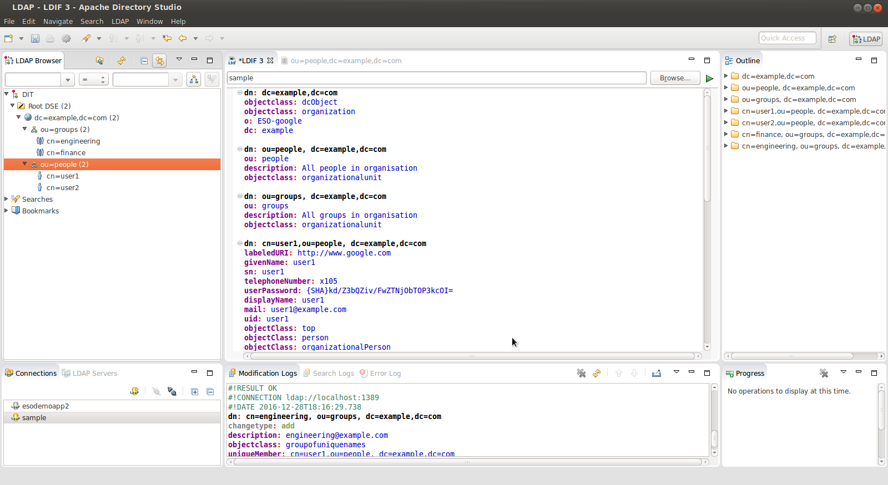

##### Verify via query
```
# local version
ldapsearch -v -x -D "cn=admin,dc=levelupfromzero,dc=dev" -w mypassword -b "ou=people,dc=levelupfromzero,dc=dev" -H ldap://localhost:1389

# container-on-a-vm version
ldapsearch -v -x -D "cn=admin,dc=levelupfromzero,dc=dev" -w mypassword -b "ou=people,dc=levelupfromzero,dc=dev" -H ldap://$LDAP_IP:80

```
If you use Directory Studio, you can browse the imported LDAP structure in the console directly.

### Setup dry-run Google Directory Sync
Once the LDAP server is running, we need to run the Directory Sync utility.

**Again only run the Directory Sync in dry-run mode!!**

Download and Start the Directory Sync utility
Download:  [https://support.google.com/a/answer/6120989](https://support.google.com/a/answer/6120989)
Launch: 
```
$ GoogleCloudDirSync/config-manager
```
#### Setup the Google Domain Configuration
You need to be domain super user to syn and run this utility:
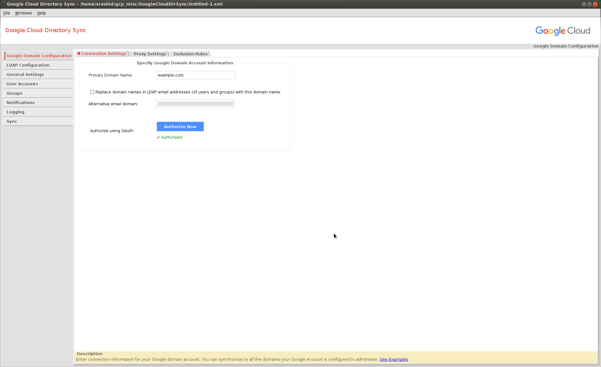

#### Connect to the LDAP server

Connect as `cn=admin,dc=levelupfromzero,dc=dev` .  The default password is `mypassword` .

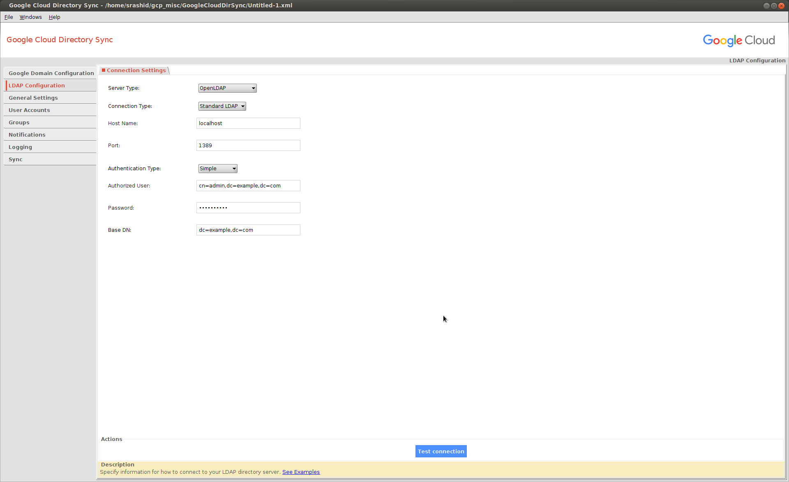

If you are using `ldaps://`, you need to add in the certificate chain first:

```
cd GoogleCloudDirSync/jre
$ keytool -keystore lib/security/cacerts -storepass changeit -import -file path_to_your/ldap_crt.pem -alias mydc
$ keytool -keystore lib/security/cacerts -storepass changeit -import -file path_to_your/CA_crt.pem -alias myca
```

#### Select Users and Groups to sync 

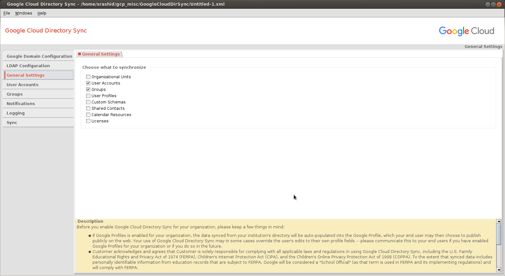

#### User Configuration 

I've made some specific maps for LDAP attributes to G Suite attributes:

* `cn` -> Unique identifer attribute 
* `mail` -> Email address to use
* `givenName` -> User's first name
* `sn` -> User's last name
* `userPassword` -> SHA1 format for the user's local LDAP password

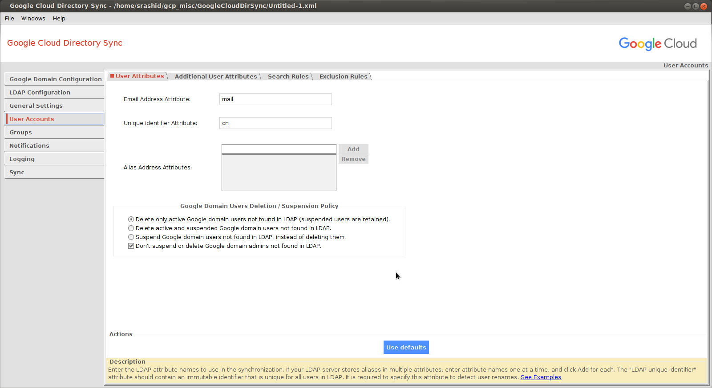


The users in LDAP are found under `ou=People,dc=levelupfromzero,dc=dev`  and the primary identifier is `cn`
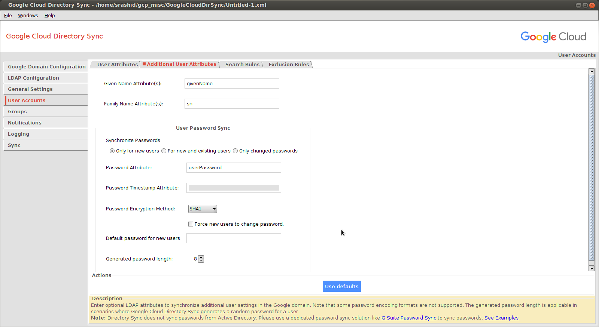


The SHA format for the password can be derived using sample utilities bundled with openldap:
```
slappasswd -h  {SHA} -s mypassword
{SHA}kd/Z3bQZiv/FwZTNjObTOP3kcOI=
```

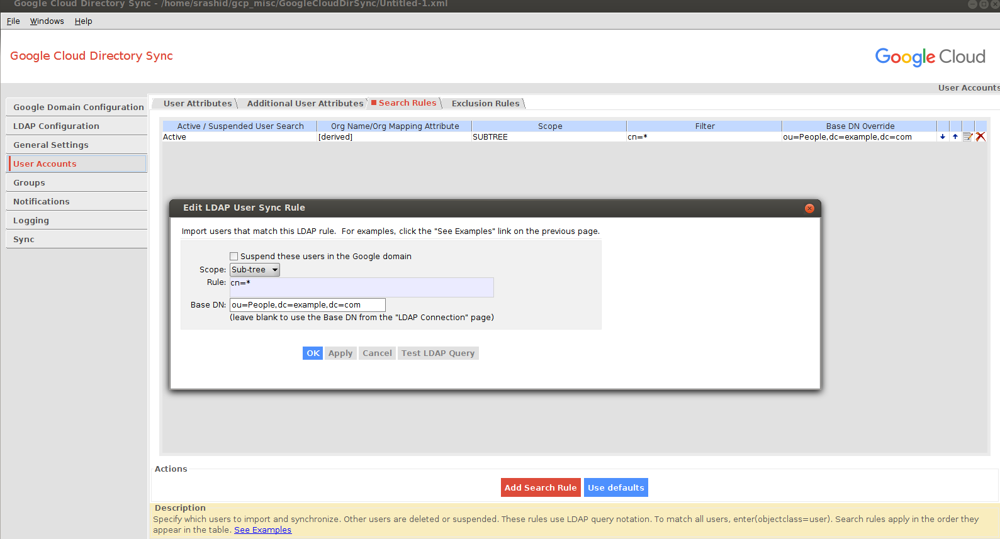


#### Groups Configuration

I did not want to override the default openldap schema so I ended up using the `description` attribute of `objectclass: groupofuniquenames`
as the attribute the utility will use to infer the Group Email Address:

* Group Email Address Attribute:  `description`

Meaning the LDAP's description field for a groupofuniquenames denotes the email address to provision in G Suite.

You can search for the groups by looking in the subtree for:
```
(&(objectClass=groupOfUniqueNames)(cn=*))
```

For example:
```
dn: cn=engineering, ou=groups, dc=example,dc=com
cn: engineering
objectclass: groupofuniquenames
description: engineering@example.com
uniqueMember: cn=user1,ou=people, dc=example,dc=com
uniqueMember: cn=user2,ou=people, dc=example,dc=com
```
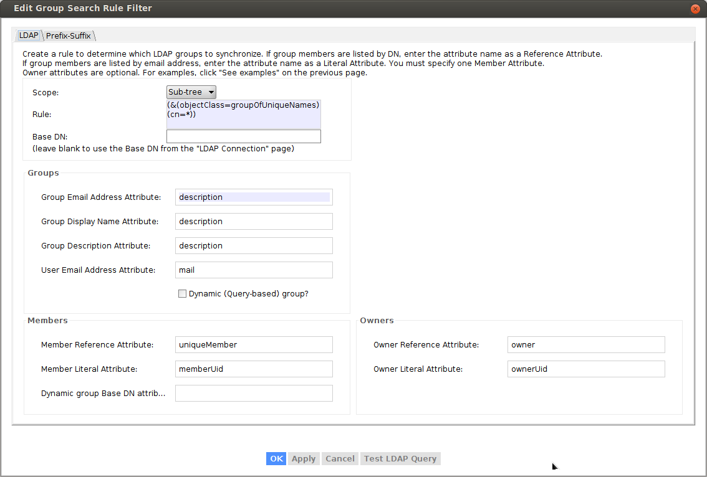

To verify, select "Test Query" button:

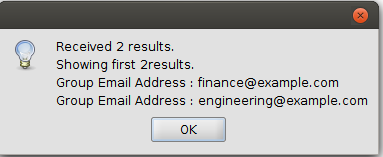

#### Execute Dry-Run Sync

Now that you are all setup, click the '_Simulate sync_' button to see what would happen.

**REMEMBER TO SELECT "SIMULATE SYNC"**

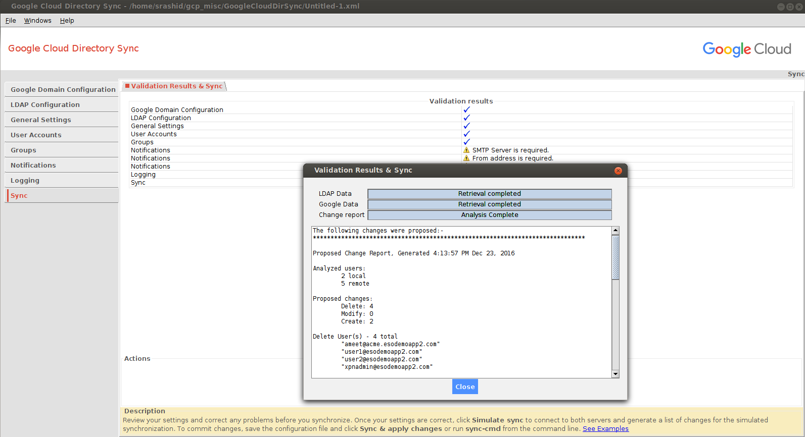

If had existing users already in my apps domain and I tried to import new ones, the reconciliation favored the local LDAP 
(meaning it would add local ldap and delete existing accounts~)

#### Execute Sync

If you are confident on the sync setup, you can initiate the full synchronization.  Once the users and groups are committed, you can
see them in the Google Apps domain console.  

Note, the setup does not sync or overwrite the domain admin users.

You can also backup/export your existing users list first to a `.csv` file prior to running the full sync.

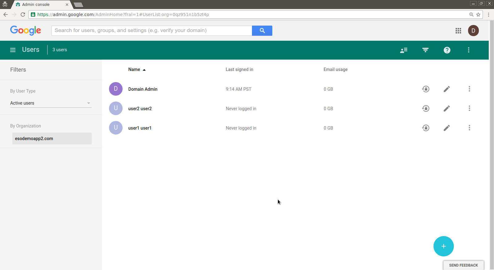

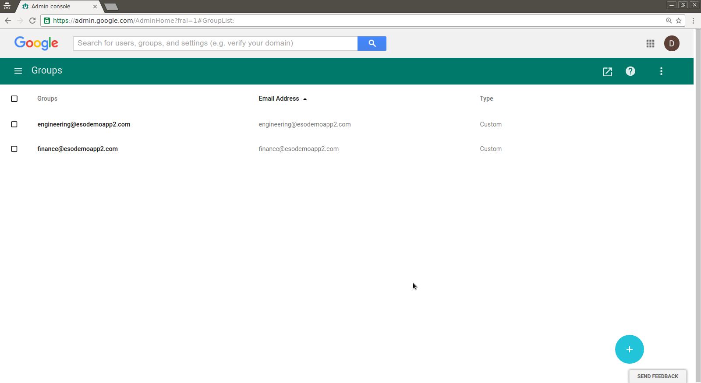


```
The following changes were applied on the Google domain:-
*****************************************************************************

Change Status Report, Generated 10:09:17 AM Dec 28, 2016


Successful user changes:
	Deleted:  0
	Modified: 0
	Created:  2

Failures:
	Delete: 0
	Modify: 0
	Create: 0

Created 2 new users
User: "user1@example.com"
	Local key "dXNlcjE"
	Given name "user1"
	Family name "user1"
	Set SHA-1 password hash

User: "user2@example.com"
	Local key "dXNlcjI"
	Given name "user2"
	Family name "user2"
	Set SHA-1 password hash


Successful group changes:
	Deleted:  0
	Modified: 2
	Created:  2

Failures:
	Delete: 0
	Modify: 0
	Create: 0

Successfully modified 2 groups
Group: "finance@example.com"
	Added user user1@example.com

Group: "engineering@example.com"
	Added user user1@example.com
	Added user user2@example.com


Created 2 new groups
Group: "engineering@example.com"
Group: "finance@example.com"

The following changes were proposed:-
*****************************************************************************

Proposed Change Report, Generated 10:09:16 AM Dec 28, 2016

Analyzed users:
	2 local
	1 remote

Proposed changes:
	Delete: 0
	Modify: 0
	Create: 2

Create - 2 total 
New user 1: "user1@example.com"
	Non-address primary key "dXNlcjE"
	Given name "user1"
	Family name "user1"
	SHA1 password
	0 aliases

New user 2: "user2@example.com"
	Non-address primary key "dXNlcjI"
	Given name "user2"
	Family name "user2"
	SHA1 password
	0 aliases


Analyzed groups:
	2 local
	0 remote

Proposed changes:
	Delete: 0
	Modify: 2
	Create: 2
Create Group(s) - 2 total
	"engineering@example.com"
	"finance@example.com"


Modify (all proposed changes) - 2 total groups affected
Modify group 1: "engineering@example.com"
	Add address "user1@example.com"
	Add address "user2@example.com"

Modify group 2: "finance@example.com"
	Add address "user1@example.com"
```

## Directory Sync via Admin API

You can also script the provisioning and management of users and groups via the G Suite APIs such as 
[Directory API](https://developers.google.com/admin-sdk/directory/v1/guides/manage-users)

```python
#!/usr/bin/python

from apiclient.discovery import build
import httplib2
from oauth2client.service_account import ServiceAccountCredentials
from oauth2client.client import GoogleCredentials
import logging
import json
import sys
from apiclient import discovery
import oauth2client
from oauth2client import client
from oauth2client import tools

scope = 'https://www.googleapis.com/auth/admin.directory.user'
credentials = ServiceAccountCredentials.from_p12_keyfile('adminapi@fabled-ray-104117.iam.gserviceaccount.com',
                                                           'project1-5fc7d442817b.p12',
                                                           scopes=scope)  
credentials = credentials.create_delegated('admin@example.com')
http = httplib2.Http()
http = credentials.authorize(http)
service = discovery.build('admin', 'directory_v1', http=http)
results = service.users().list(customer='C023zw2x7', domain='example.com').execute()
users = results.get('users', [])
print json.dumps(users, sort_keys=True, indent=4)
for u in users:
  print json.dumps(u['primaryEmail'], sort_keys=True, indent=4)
```
